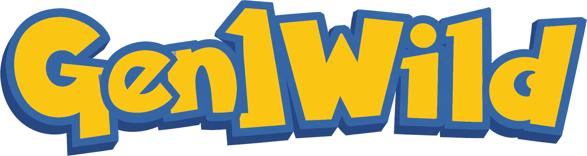
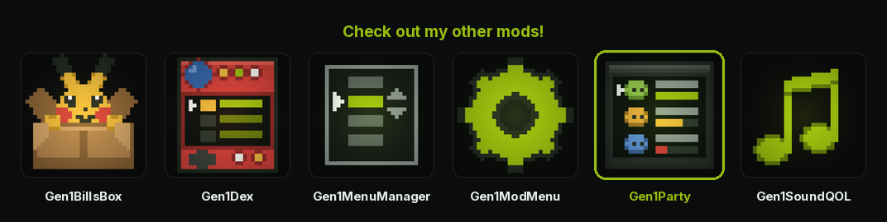

<p align="center">
  <a href="https://wild1walker.github.io/Gen1Wild/"></a>
</p>

<h1 align="center">Gen1BattleUI</h1>

<p align="center">
  
</p>

<p align="center">
  <a href="https://wild1walker.github.io/Gen1Wild/"></a>
</p>

The battle menu, as four buttons instead of a list.

A mod for [Gen1Recomp](https://github.com/bryanthaboi/gen1recomp).

---

## What it does

### Four buttons, in the game's own boxes

**`FIGHT`**, **`PKMN`**, **`ITEM`** and **`RUN`** each get a bordered box of
their own, laid out two by two across the bottom of the screen. The four moves
get the same four boxes when you pick `FIGHT`.

Nothing new was invented to draw them. A button here is `Font.drawBox` — the
same call, the same border glyphs, the same white interior every text box in
the game is made of — so a skin or a font mod that redraws the border redraws
these buttons with it, and this mod never has to know it happened.

That decision is also what fixes the sizes. A Game Boy text box spends its
first and last tile row on its border, so the smallest box that can hold a
line of text is **three tile rows**. Two rows of buttons is six, which is
exactly the six rows the classic layout's bottom strip has:

```
rows 12-14   FIGHT | PKMN        four 10x3 boxes, tiling
rows 15-17   ITEM  | RUN         the twenty-by-six strip exactly
```

### The grid was already in the numbers

The engine has always read the command menu as a 2×2 — `col = (i-1) % 2`,
`row = (i-1) // 2`, which is why <kbd>←</kbd> and <kbd>→</kbd> already crossed
between `FIGHT` and `PKMN`. It was only ever *drawn* as four words in one box.
So none of the menu's behaviour is replaced here: `menuIndex` is still the
engine's, still means what it meant, and is still moved by the engine's own
input handling. This is the drawing catching up with the arithmetic.

The move menu is the one that actually changes. It was a vertical list, so
<kbd>←</kbd> and <kbd>→</kbd> did nothing; the engine already has a hook for
making it a grid (`battle.move_grid_navigation`, which the widescreen layout
answers for itself), and this mod answers it too.

### Dialogue takes the strip back on its own

There is no handoff to get wrong. The mod asks the engine not to draw the
bottom strip for the three phases that are a *menu* — the command menu, the
move menu, and Mimic's copy menu — and asks for nothing else. `messages` is
left completely alone, so when the battle talks it is still the engine's own
text box, in the engine's own place, with the engine's own scroll and its own
blinking arrow. The buttons are simply not drawn underneath it, and they are
back on the frame the menu is.

The same rule is what keeps `PKMN` and `ITEM` working. A battle with a screen
open above it is still a battle whose strip is being drawn, so a mod claiming
it on the phase alone would take that screen's own prompts down with it. The
strip is claimed only while the battle is the **top** of the state stack.

### `ITEM` parks the menu rather than replacing it

The bag does not leave the menu, it opens **on** it. Its item list is the one
list in the game that is not a screen of its own — `ListMenu`'s `itemBox`,
`isOpaque = false`, *"a partial box the map stays visible around"* — and it is
sixteen tiles at (4,2), so it stops at y=103 and the strip underneath is still
on screen.

So the buttons stay up, and the hand on `ITEM` goes **hollow**: the same
marker every list in this game leaves on the row it is acting on. No filled
hand is drawn anywhere, because the cursor is not in the grid any more.

That state is deliberately **not** claimed. Returning `false` for the battle
would take the bag's own boxes with it — `How many?`, the `YES`/`NO`, the use
message — because every box above a battle inherits the battle's answer. So
the engine keeps drawing its empty box and the buttons go over the top of it,
which lands in the same pixels: the four button boxes tile exactly the
twenty-by-six that box occupies.

`PKMN` reaches the same code and is never seen down it — `PartyMenu` is
opaque, so the stack stops drawing at it and the battle underneath, this
overlay included, never runs at all.

### What two columns inside 160 pixels costs

A classic cell is the box's eight interior tiles less the one kept for the
cursor: **seven glyphs**, where the vanilla list had fourteen. So long move
names are cut, with the engine's own trailing-dot idiom:

| | |
| --- | --- |
| `QUICK ATTACK` | `QUICK.` |
| `THUNDERSHOCK` | `THUNDE.` |
| `SAND-ATTACK` | `SAND-A.` |

That is the real price of the layout, and it is paid back rather than hidden.
The panel above the grid carries the highlighted move's **full name**, its
type and its PP — which the vanilla list never showed all at once either, and
it sits exactly where the vanilla `TYPE/PP` box sat, covering what that box
covered.

**`MOVE PANEL`** in the mod manager turns it off and gives the picture behind
it back.

### Widescreen too

`OPTION` → `BATTLE LAYOUT` → `WIDE` gets the same grid, built differently.

Five tile rows is what that layout's strip has, and six do not fit in five
without eating a row of battlefield. So instead of four boxes it is **one box
ruled into four cells** with its own border glyphs — five rows being exactly
border, text, rule, text, border. Same grid, same cells, one shared frame
instead of four.

The wide cells are twelve glyphs, which is what that layout's own move grid
already gave, so names arrive whole there and nothing is cut. Its
`What will X do?` prompt keeps the left half of the strip, and the move
panel keeps its ten tiles on the right.

---

## Options

| Row | Default | What it does |
| --- | --- | --- |
| `MOVE PANEL` | on | The full name, type and PP of the highlighted move, above the grid. Off gives the picture behind it back — and, on the wide layout, gives its ten tiles to the grid, because a strip that stops short of the screen edge is a hole in the frame rather than a saving. |

---

## What it does not touch

- **What the menus do.** Only where they are drawn. Every index, every key,
  every callback is still the engine's, so anything wrong with what the battle
  menu *does* is not this mod.
- **Dialogue, and everything above it.** The text box, its scroll, its
  wait arrow, and every screen pushed over the battle.
- **The HP panels, the pictures, the animations.** The whole top of the
  screen is untouched.

## Known

- **Seven glyphs is seven glyphs.** `THUNDERSHOCK` reads `THUNDE.` in its
  cell, and no arrangement of two columns inside 160 pixels changes that. The
  panel above is the answer, and turning it off is choosing not to have one.
- **`THROW ROCK` is cut in a Safari battle** — ten glyphs against seven. It
  reads `THROW.`, with the trailing space taken off the cut rather than left
  as `THROW .`. The wide layout has room and prints it whole.
- **The overlay draws after the palette pass,** so the buttons are black on
  white and are not recoloured by a `COLORS` zone the way the vanilla strip's
  border is. On the default look this is the same picture; under a mode that
  tints the text box it is not.
- **A throw while drawing costs a frame's buttons, not the battle.** The draw
  is wrapped and logged; a load-time failure is *not* swallowed, and marks the
  row enabled-but-broken in `MODS` with the reason, because an enabled mod
  that silently changes nothing looks exactly like one that was never
  installed.

---

## Install

**MODS** → **Import mod .zip**, or add the index at **MODS** → **FIND MODS**:

```
wild1walker/Gen1Wild
```

## Credits

- **Gen1Recomp** — the battle hooks this is built on: `battle.overlay`,
  `battle.bottom_ui_visible` and `battle.move_grid_navigation` were already
  there, and this mod is what happens when a mod uses all three.
- **pret/pokered** — `engine/battle/core.asm`, whose `DisplayBattleMenu` and
  `MoveSelectionMenu` are the two screens this re-dresses, and whose 2×2
  reading of `menuIndex` is why the command menu needed no new input handling.
- **Nintendo / Creatures / GAME FREAK** — Pokémon Red, Blue and Yellow.
  Unofficial fan mod, no affiliation, no endorsement.

MIT. See [LICENSE](LICENSE).
